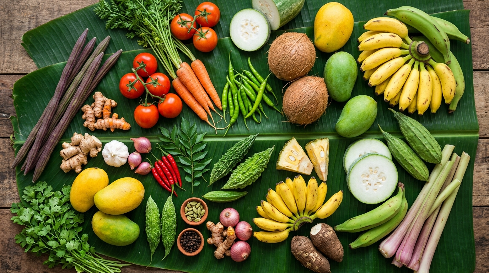

# 🌿 Today's Price — Kerala Market Prices

<p align="center">
  
</p>

<p align="center">
  
  
  
  
</p>

<p align="center">
  <strong>A simple, clean web app that shows today's live market prices of vegetables, fruits & daily groceries in Kerala.</strong><br>
  Built to protect tourists and newcomers from being overcharged at local markets.
</p>

<p align="center">
  <a href="https://your-demo-link.netlify.app">🔗 Live Demo</a> •
  <a href="#features">✨ Features</a> •
  <a href="#screenshots">📸 Screenshots</a> •
  <a href="#getting-started">🚀 Getting Started</a>
</p>

---

## 🧩 The Problem

Tourists and newcomers in Kerala often don't know the **fair local market price** of everyday items like vegetables, fruits, and groceries. This makes them easy targets for overcharging by some shop owners.

**Today's Price** solves this by giving everyone instant access to current Kerala wholesale market rates — so you always know what a fair price looks like before you shop.

---

## ✨ Features

- 🔍 **Search** any product by name (English or Malayalam)
- 📂 **Filter by category** — Vegetables, Fruits, Groceries
- 🖼️ **Product images** for every item
- 🇮🇳 **Malayalam names** alongside English
- 💰 **Price range bar** — see the min & max market rate
- 📅 **Today's date** displayed with a live indicator
- 📱 **Fully responsive** — works on mobile & desktop
- ⚡ **No installation needed** — just open `index.html` in a browser

---

## 📸 Screenshots

### 🖥️ Desktop View


### 📱 Mobile View
> Clean 2-column card layout optimized for small screens

---

## 🛒 Products Covered

| Category | Items |
|---|---|
| 🥦 **Vegetables** | Tomato, Onion, Potato, Carrot, Beans, Cabbage, Bitter Gourd, Brinjal, Ladies Finger, Drumstick, Green Chilli, Ginger, Garlic, Cucumber, Snake Gourd, Raw Banana |
| 🍎 **Fruits** | Nendran Banana, Mango, Papaya, Pineapple, Coconut, Watermelon, Apple, Grapes, Pomegranate, Guava, Orange |
| 🌾 **Groceries** | Rice (Jyothi), Coconut Oil, Sugar, Toor Dal, Wheat Flour, Salt, Mustard Seeds, Red Chilli Powder, Turmeric Powder, Urad Dal, Groundnut Oil |

> **Total: 38+ products** — more being added regularly

---

## 🚀 Getting Started

### Option 1 — Open locally (Easiest)

1. **Clone the repository**
   ```bash
   git clone https://github.com/your-username/todays-price.git
   ```

2. **Open the app**
   ```
   Double-click index.html
   ```
   That's it! No server, no npm, no setup needed. ✅

### Option 2 — Deploy online for free

**Netlify Drop (No account needed):**
1. Go to [app.netlify.com/drop](https://app.netlify.com/drop)
2. Drag and drop the project folder
3. Get your live link instantly 🎉

**GitHub Pages:**
1. Push this repo to GitHub
2. Go to `Settings → Pages → Branch: main → Save`
3. Your link: `https://your-username.github.io/todays-price`

---

## 🗂️ Project Structure

```
todays-price/
│
├── index.html      # The entire app (HTML + CSS + JS in one file)
└── hero.jpg        # Kerala market banner image
```

> Intentionally kept as a **single file** — easy to understand, easy to share, and beginner-friendly.

---

## 🛠️ Tech Stack

| Technology | Purpose |
|---|---|
| **HTML5** | App structure and layout |
| **CSS3** | Styling, animations, responsive design |
| **Vanilla JavaScript** | Search, filtering, rendering logic |
| **Google Fonts (Poppins)** | Typography |
| **Unsplash** | Product images (free CDN) |

---

## 🗺️ Roadmap

- [ ] Admin panel to update prices daily
- [ ] Malayalam language UI toggle
- [ ] WhatsApp share button for individual product prices
- [ ] Add more products (fish, meat, dairy, spices)
- [ ] Offline support (PWA)
- [ ] Price history chart

---

## 🤝 Contributing

Contributions are welcome! If you know current Kerala market prices or want to add more products:

1. Fork this repository
2. Edit the `PRODUCTS` array in `index.html`
3. Submit a Pull Request

---

## ⚠️ Disclaimer

Prices shown are **indicative** and based on average Kerala wholesale/retail market rates. Actual prices may vary by shop, location, season, and demand. Always verify with the seller.

---

## 📄 License

This project is licensed under the [MIT License](LICENSE) — free to use, share, and modify.

---

## 👨‍💻 Author

Made with ❤️ for **Kerala** 🌴

> *"Knowledge is the best protection — know the price before you buy."*

---

<p align="center">
  ⭐ If this helped you, please give it a star on GitHub! It motivates me to keep building.
</p>
